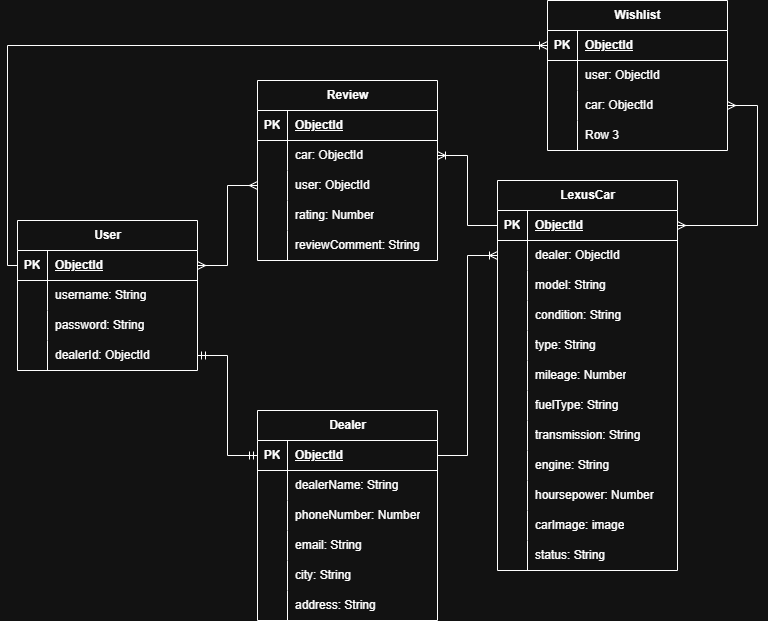

# All Lexus

## Overview

## Screenshots

## Technologies Used

## Getting Started

## Installation

## User Stories
1.	As a user, I want a website to view all Lexus cars used or new. 
2.	As a user, I want to explore all cars from all dealers in one page.
3.	As an authorized user, I want to see the car picture before viewing the details.
4.	As an authorized user, I want to view all the car details.
5.	As an authorized user, I want a wish list to add the car that I like in.
6.	As an authorized user, I want to buy the car that I like.
7.	As an authorized user, I want to view the dealer information.
8.	As an authorized user, I want to rate and give comment to any car.
9.	As a dealer, I want to add cars, edit them and delete the sold ones.
10.	As a dealer, I want to make an account.
11.	As a dealer, I want to edit my information.
12.	As a dealer, I want to delete my account at any time.
## Database Design

## Routes

| Method | Route | Description |
|---------|-------|-------------|
| GET | / | Home page |
| GET | /listings | List all listings |
| GET | /listings/new | New listing form |
| POST | /listings | Create listing |
| GET | /listings/:id | View listing |
| GET | /listings/:id/edit | Edit listing form |
| PUT | /listings/:id | Update listing |
| DELETE | /listings/:id | Delete listing |

## Features

## Future Enhancements

## Credits