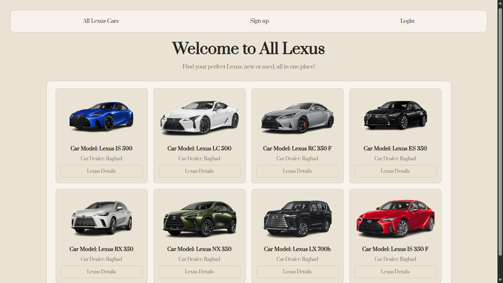
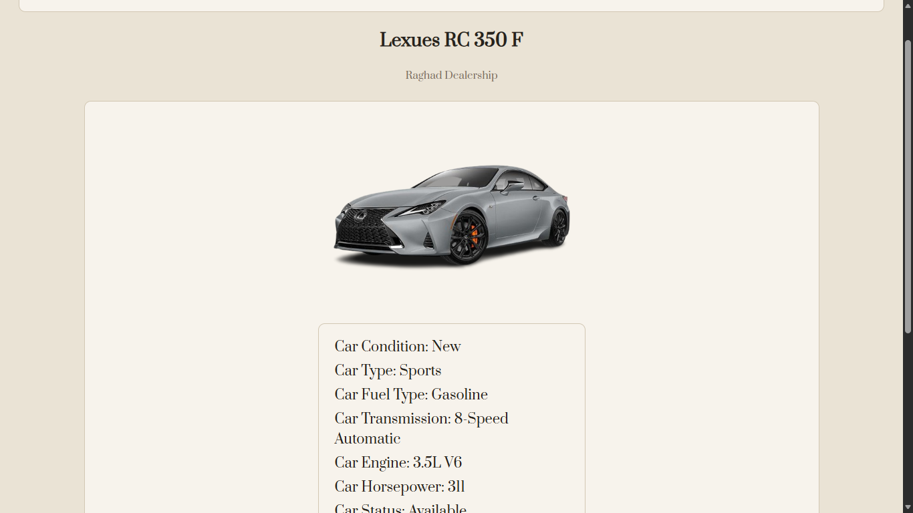
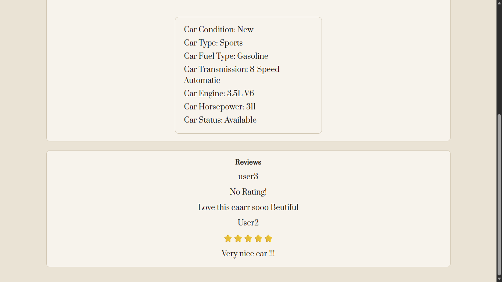
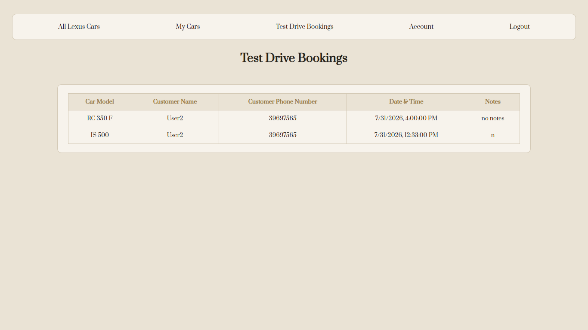
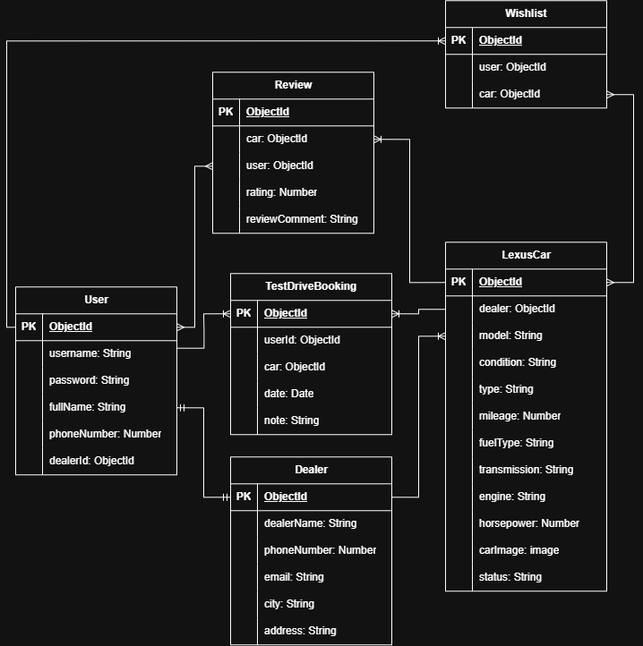

# All Lexus

## Overview

All Lexus is a full-stack marketplace built for Lexus fans they can browse new and used cars listed by multiple dealers, book a test drive, leave a rating and review, and keep thier favorite cars in a wishlist. Dealers get their own account to list, edit, and manage their inventory, manage their inventory and view incoming test drive bookings.

## Screenshots






## Technologies Used

1. HTML
2. CSS
3. JavaScript
4. Node.js / Express
5. MongoDB / Mongoose
6. EJS
7. bcrypt (password hashing)
8. Multer (image uploads)


## Getting Started

[Deployed App](https://all-lexus.onrender.com/)

## Installation

1. Clone the Repository:
   ```
   git clone https://github.com/RaghadHussain/All-Lexus.git

   cd All-Lexus
   ```
2. Install Dependencies:
   ```
   npm i
   ```
3. Create a `.env` File in the Project Root with:
   ```
   MONGODB_URI = your MongoDB connection string
   SESSION_SECRET = any secret string
   PORT = 3000
   ```
4. Start the App:
   ```
   nodemon server.js
   ```
5. Visit `http://localhost:3000` in Your Browser.

## User Stories

1. As a user, I want a website to view all Lexus cars, used or new.
2. As a user, I want to explore all cars from all dealers on one page.
3. As an authorized user, I want to see the car's picture before viewing its details.
4. As an authorized user, I want to view all the car details.
5. As an authorized user, I want a wishlist to add the cars that I like.
6. As an authorized user, I want to book a test drive for a car that I like.
7. As an authorized user, I want to view the dealer's information.
8. As an authorized user, I want to rate and leave a comment on any car.
9. As an authorized user, I want to view my own account details.
10. As a dealer, I want to add cars, edit them, and delete the ones that are sold.
11. As a dealer, I want to make an account.
12. As a dealer, I want to edit my information.
13. As a dealer, I want to view the test drive bookings my customers have requested.

## Database Design



## Routes

### Authentication Routes 

| Method | Route | Description |
|--------|-------|-------------|
| GET | /sign-up | User sign-up form |
| POST | /sign-up | Create a user account |
| GET | /dealer/sign-up | Dealer sign-up form |
| POST | /dealer/sign-up | Create a dealer account |
| GET | /sign-in | Sign-in form |
| POST | /sign-in | Sign in |
| GET | /sign-out | Sign out |

### Home Routes 

| Method | Route | Description |
|--------|-------|-------------|
| GET | / | Home page — lists all cars from every dealer |

### Car Routes 

| Method | Route | Description |
|--------|-------|-------------|
| GET | /new | New car listing form (dealer only) |
| POST | /new | Create a car listing |
| GET | /:id | View a car's details |
| GET | /:id/edit | Edit car listing form |
| PUT | /:id/edit | Update a car listing |
| DELETE | /:id | Delete a car listing |
| POST | /:id/review | Add a review to a car |
| DELETE | /:carId/:id/deleteReview | Delete a review |

### Dealer Routes 

| Method | Route | Description |
|--------|-------|-------------|
| GET | /myCars | View a dealer's own listings |
| GET | /account | View dealer account info |
| GET | /:id/edit | Edit dealer info form |
| PUT | /:id/edit | Update dealer info |

### Wishlist Routes

| Method | Route | Description |
|--------|-------|-------------|
| GET | / | View the current user's wishlist |
| POST | /:id | Add a car to the wishlist |
| DELETE | /:id | Remove a car from the wishlist |

### Test Drive Routes

| Method | Route | Description |
|--------|-------|-------------|
| GET | /viewBookings | View incoming bookings (dealer only) |
| GET | /:carId | Test drive booking form |
| POST | /:carId | Create a test drive booking |

### User Routes 

| Method | Route | Description |
|--------|-------|-------------|
| GET | / | View the current user's profile |

## Features
- Browse all Lexus car listings from every dealer in one place
- View detailed car information, images, and dealer
- Rate and leave comments on cars
- Add or remove cars from a personal wishlist
- Book a test drive directly with a dealer
- Separate sign-up/sign-in flows for regular users and dealers
- Dealer dashboard to add, edit, and delete their own car listings
- Dealers can view incoming test drive bookings
- Image uploads for cars  

## Future Enhancements

1.  Search and filter listings by model, price, condition, and location
2.  A dedicated dealer dashboard that brings listings, bookings, and account management into one place
3.  Homepage sections like Featured Cars, New Arrivals, and Best Deals to help great listings stand out
4.  Dealer and User account deletion
5.  Email notifications for test drive bookings


## Credits

Special thanks to Mr. Omer, our Lead Instructor, and Mr. Zaid, our Assistant Instructor without their support and efforts this project wouldn't have come together.
